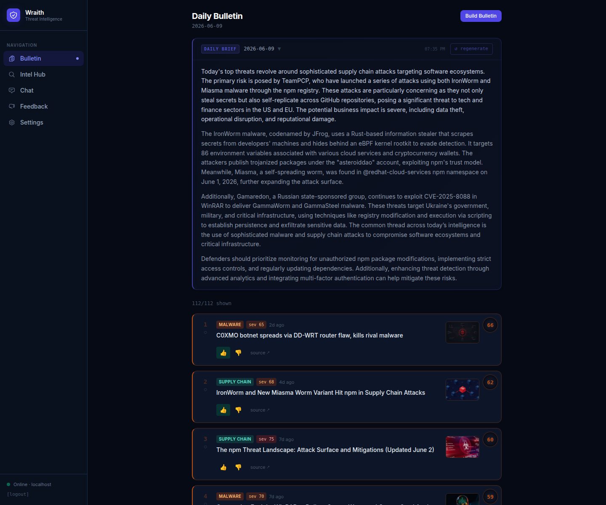
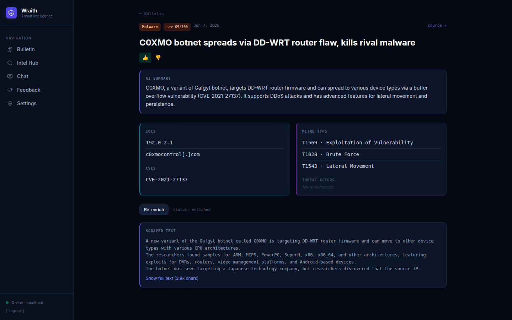
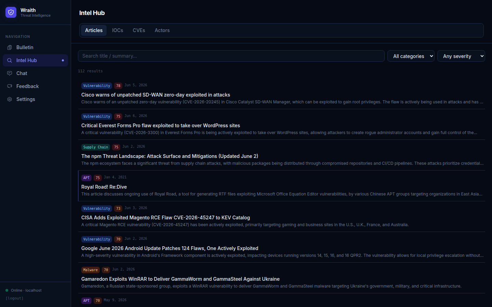

# Wraith

[](LICENSE)

Self-hosted threat intelligence platform for solo analysts. Ingests RSS feeds, scrapes articles, runs LLM enrichment, and builds a daily ranked bulletin that gets smarter as you rate things.

No cloud required. Runs entirely on localhost against a local Ollama model.

---







---

## What it does

- **Daily Bulletin** — articles ranked by a combined threat severity + personal relevance score. Thumbnails pulled from feed media or article OG images. Paginated, filterable, dismissable.
- **Feedback loop** — 👍/👎 on any article (bulletin or article detail page) feeds back into tomorrow's ranking. Activates after a few signals. Reason tags let you be specific about why something was irrelevant.
- **Interest Profile** — declare sectors, threat actors, categories, and keywords. Scores every article from day one without needing any ratings first.
- **LLM Enrichment** — extracts summary, threat category, severity, sector targets, IOCs, MITRE TTPs, threat actors, and CVE mentions from each article.
- **Intel Hub** — search across articles, IOCs, CVEs, and actors.
- **RAG Chat** — ask questions against your intel database.
- **Score breakdown** — click the score bubble on any bulletin card to see how the score was computed.

---

## Stack

| | |
|---|---|
| Backend | Python 3.12+, FastAPI, SQLAlchemy, Alembic, SQLite / PostgreSQL |
| Frontend | React 19, Vite, Tailwind v3, TanStack Query |
| LLM | Ollama (default) or Anthropic API |
| Feed ingestion | feedparser, trafilatura, httpx |

---

## Quick start

```bash
# Install Ollama and pull a model
curl -fsSL https://ollama.com/install.sh | sh
ollama pull qwen2.5:7b

# Clone and configure
git clone <repo> wraith && cd wraith
cp .env.example .env

# Install everything and run migrations
./start.sh setup

# Start
./start.sh dev
```

Open **http://localhost:5173** and sign in (default: `admin` / `wraith` from your `.env`).

Then from Settings, run Ingest → Enrich → Build Bulletin to get your first results.

---

## Configuration

All settings live in `.env`. The defaults work for a local Ollama setup.

```ini
DATABASE_URL=sqlite:///./cti.db

LLM_PROVIDER=ollama
LLM_BASE_URL=http://localhost:11434/v1
LLM_MODEL=qwen2.5:7b

# Optional: switch to Anthropic
# LLM_PROVIDER=anthropic
# ANTHROPIC_API_KEY=sk-ant-...
# LLM_MODEL=claude-sonnet-4-5

# Optional: NVD API key for higher rate limits on CVE lookups
NVD_API_KEY=

ENRICH_BATCH_SIZE=5
ENRICH_DELAY_SECONDS=0

# Scheduled jobs (UTC hours)
INGEST_HOUR=7
ENRICH_HOUR=8
CVE_SYNC_HOUR=9
BULLETIN_HOUR=10

SECRET_KEY=change-me-use-a-long-random-string
AUTH_USERNAME=admin
AUTH_PASSWORD=wraith
```

To use PostgreSQL instead of SQLite, just swap `DATABASE_URL` and run `./start.sh migrate`.

---

## start.sh commands

```bash
./start.sh setup      # venv, deps, migrations, seed sources, npm install
./start.sh dev        # start API (:8000) + frontend (:5173)
./start.sh migrate    # run pending migrations
./start.sh stop       # kill dev processes
./start.sh reset-db   # drop and recreate the SQLite DB
```

---

## Notes

- Enrichment is slow on CPU (~30–90s per article). If you're CPU-only, set `ENRICH_BATCH_SIZE=1`.
- `qwen2.5:14b` gives meaningfully better extraction quality if you have the VRAM for it.
- Ollama handles one inference at a time — chat requests will queue if enrichment is running.
- The weekly pruning job (Sunday 03:00 UTC) clears scraped text from old articles and removes stale unenriched ones. Run it manually from Settings → Storage & Retention.

---

## License

MIT
