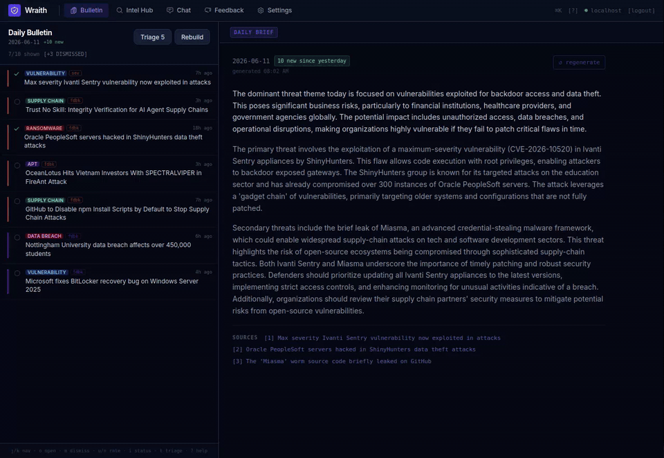

# Wraith

[](LICENSE)

Self-hosted threat intelligence platform for solo analysts. Ingests RSS feeds, scrapes articles, runs LLM enrichment, and builds a daily ranked bulletin that gets smarter as you rate things.

No cloud required. Runs entirely on localhost against a local Ollama model.

---



---

## What it does

- **Daily Bulletin** — new articles ranked by a combined threat severity + personal relevance score, in a two-pane reader with the AI daily brief. Only genuinely new articles each day (capped at `BULLETIN_MAX_ITEMS`), with LLM confirmation of multi-article story clusters.
- **Feedback loop** — 👍/👎, dismissals, and even just *opening* an article feed back into tomorrow's ranking. Reason tags let you be specific about why something was irrelevant.
- **Triage mode** — press `t` for a full-screen, one-key-per-article review flow with auto-advance and end-of-session stats.
- **Learning enrichment** — analyst corrections (deleted IOCs, whitelisted domains, edited entities) are fed back into the enrichment prompt as do-not-repeat examples.
- **Interest Profile + Watchlist** — declare sectors, actors, categories, keywords; pin actors/CVEs to the watchlist for a guaranteed relevance boost.
- **Suggested weights** — one click analyzes your rating history and proposes scoring weights that match what you actually read.
- **LLM Enrichment** — summary, threat category, severity, sector targets, IOCs, MITRE TTPs, threat actors, CVE mentions; optional semantic embeddings for similarity scoring and chat retrieval.
- **Intel Hub** — search across articles, IOCs, CVEs (with plain-English AI summaries), and actors.
- **Analyst Query Chat** — deterministic counts and timelines, relationship-aware retrieval, clickable article citations, evidence excerpts, and semantic RAG synthesis when embeddings are enabled.
- **Command palette & keyboard-first UI** — `Ctrl+K` palette, `g`-chords for page navigation, full one-handed bulletin triage (`?` shows the cheat sheet).
- **Score breakdown** — click any score bubble to see exactly how it was computed, including which past ratings drove it.
- **Investigations** — create named workspaces, add articles, and attach freeform notes to track an active incident or research thread. Open with `g n` or the sidebar icon.
- **Saved Searches** — save Intel Hub filter combinations for quick reuse; optionally enable alerts that fire when new articles exceed a severity threshold.
- **Export** — download enriched articles from a bulletin or investigation as STIX 2.1, MISP JSON, generic JSON, or CSV.

---

## Stack

| | |
|---|---|
| Backend | Python 3.12+, FastAPI, SQLAlchemy, Alembic, SQLite / PostgreSQL |
| Frontend | React 19, Vite, Tailwind v3, TanStack Query |
| LLM | Ollama (default) or Anthropic API |
| Feed ingestion | feedparser, trafilatura, httpx |

---

## Quick start

```bash
# Install Ollama and pull a model
curl -fsSL https://ollama.com/install.sh | sh
ollama pull qwen2.5:7b

# Clone and configure
git clone <repo> wraith && cd wraith
cp .env.example .env

# Install everything and run migrations
./start.sh setup

# Start
./start.sh dev
```

Open **http://localhost:5173** and sign in (default: `admin` / `wraith` from your `.env`).

Then from Settings, run Ingest → Enrich → Build Bulletin to get your first results.

---

## Configuration

All settings live in `.env`. The defaults work for a local Ollama setup.

```ini
DATABASE_URL=sqlite:///./cti.db

LLM_PROVIDER=ollama
LLM_BASE_URL=http://localhost:11434/v1
LLM_MODEL=qwen2.5:7b

# Optional: switch to Anthropic
# LLM_PROVIDER=anthropic
# ANTHROPIC_API_KEY=sk-ant-...
# LLM_MODEL=claude-sonnet-4-5

# Optional but recommended: semantic embeddings (ollama pull nomic-embed-text)
# Enables semantic chat retrieval + similarity-based feedback signals
EMBEDDING_MODEL=nomic-embed-text

# Optional: NVD API key for higher rate limits on CVE lookups
NVD_API_KEY=

ENRICH_DELAY_SECONDS=0
BULLETIN_MAX_ITEMS=30
LLM_CONFIRM_STORY_CLUSTERS=true

# Optional: push the daily brief to an ntfy-style webhook each morning
# BRIEF_WEBHOOK_URL=https://ntfy.sh/your-topic

# Scheduled jobs (UTC hours)
INGEST_HOUR=7
ENRICH_HOUR=8
CVE_SYNC_HOUR=9
BULLETIN_HOUR=10

SECRET_KEY=change-me-use-a-long-random-string
AUTH_USERNAME=admin
AUTH_PASSWORD=wraith
```

To use PostgreSQL instead of SQLite, just swap `DATABASE_URL` and run `./start.sh migrate`.

---

## start.sh commands

```bash
./start.sh setup      # venv, deps, migrations, seed sources, npm install
./start.sh dev        # start API (:8000) + frontend (:5173)
./start.sh migrate    # run pending migrations
./start.sh stop       # kill dev processes
./start.sh reset-db   # drop and recreate the SQLite DB
```

---

## Keyboard shortcuts

Press `?` anywhere for the full cheat sheet. The bulletin is designed for **one-handed triage** — everything sits in the right-hand home cluster:

| Key | Action |
|---|---|
| `j` / `k` | next / previous article |
| `h` or `Esc` | back to the daily brief |
| `o` or `Enter` | open full article page |
| `m` | dismiss + advance |
| `u` / `n` | thumbs up / down + advance |
| `i` | cycle read status |
| `Space` / `Shift+Space` | scroll the reading pane |
| `,` / `.` | previous / next page |
| `1`–`9` | jump to rank N |
| `y` | copy source URL |
| `t` | triage mode |
| `e` | raw text popout with highlighted enrichments (article page) |
| `g` then `b`/`i`/`n`/`c`/`f`/`s` | go to Bulletin / Intel / Investigations / Chat / Feedback / Settings |
| `Ctrl+K` | command palette |

---

## Notes

- Enrichment is slow on CPU (~30–90s per article). Use `ENRICH_DELAY_SECONDS` to pace it.
- `qwen2.5:14b` gives meaningfully better extraction quality if you have the VRAM for it.
- Ollama handles one inference at a time — chat requests will queue if enrichment is running.
- The weekly pruning job (Sunday 03:00 UTC) clears scraped text from old articles and removes stale unenriched ones. Run it manually from Settings → Storage & Retention.
- Validate prompt/model changes with the eval harness: `python -m scripts.eval_enrichment` (from `backend/`).
- Run the test suite with `python -m pytest tests/` (from `backend/`).

---

## License

MIT
